# 🏗️ ECHOMIND AI - ARCHITECTURE IN MERMAID FORMAT

## 1️⃣ SYSTEM ARCHITECTURE OVERVIEW

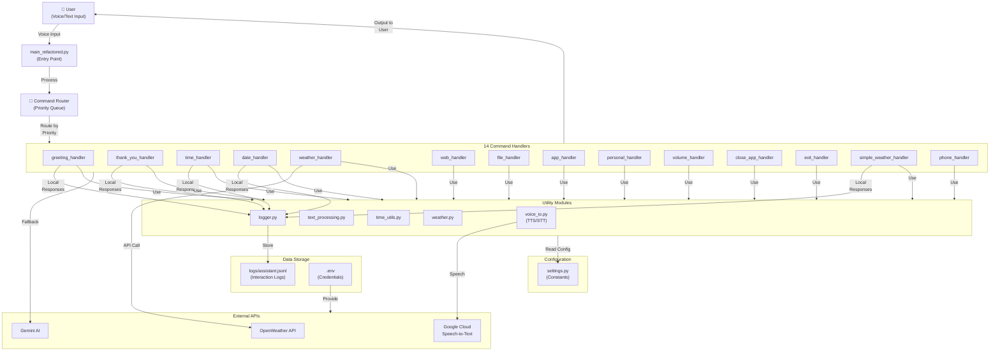

---

## 2️⃣ REQUEST PROCESSING FLOW

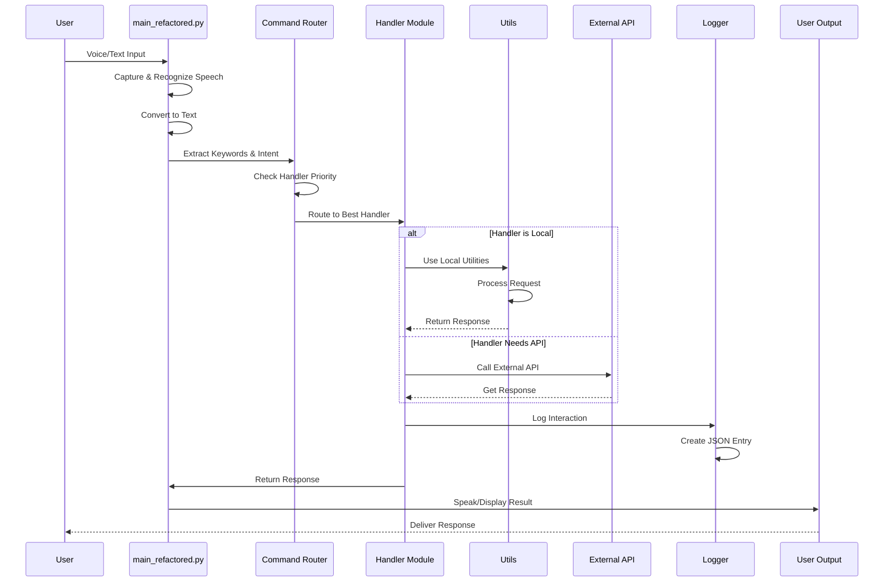

---

## 3️⃣ HANDLER PRIORITY DECISION TREE

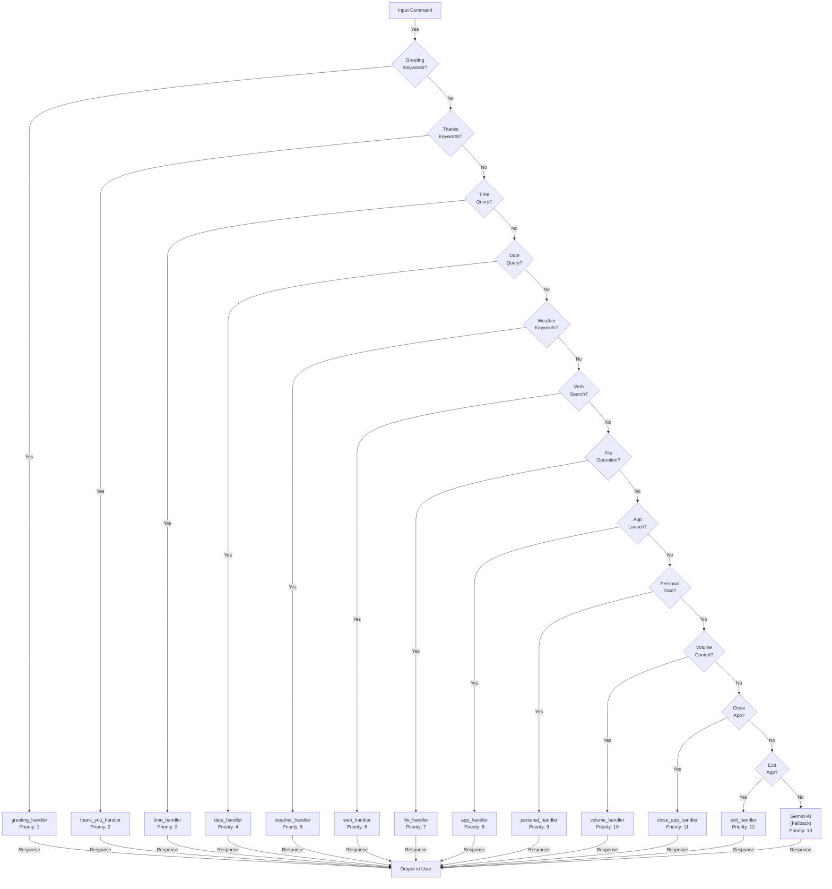

---

## 4️⃣ MODULE ARCHITECTURE

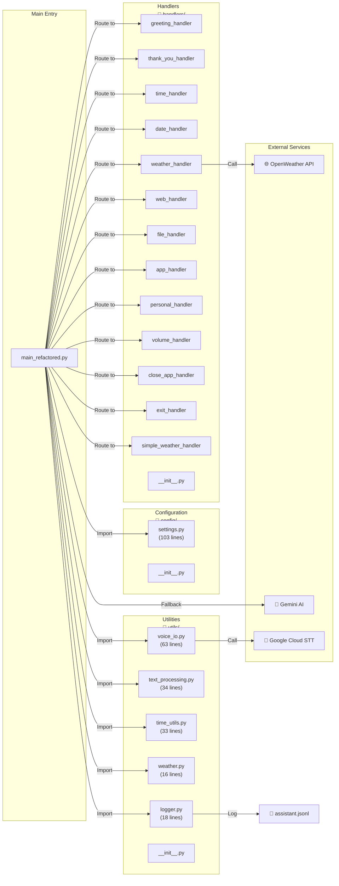

---

## 5️⃣ DATA FLOW - EXTERNAL APIs

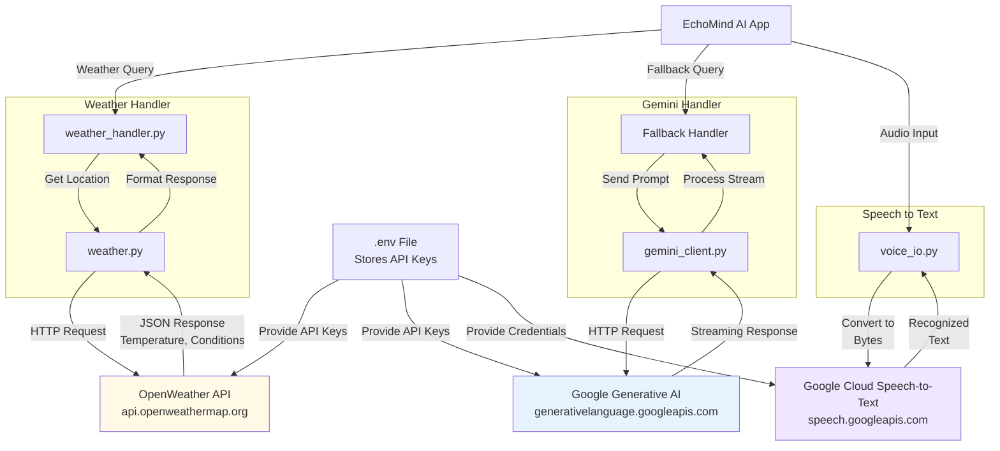

---

## 6️⃣ HANDLER EXECUTION MODEL

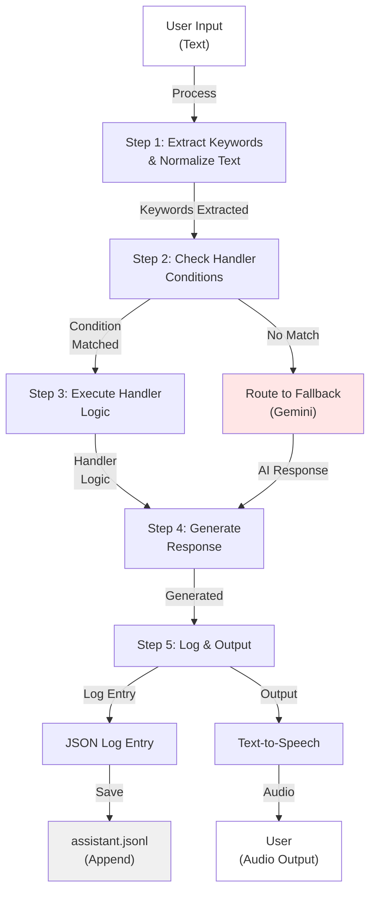

---

## 7️⃣ CONFIGURATION HIERARCHY

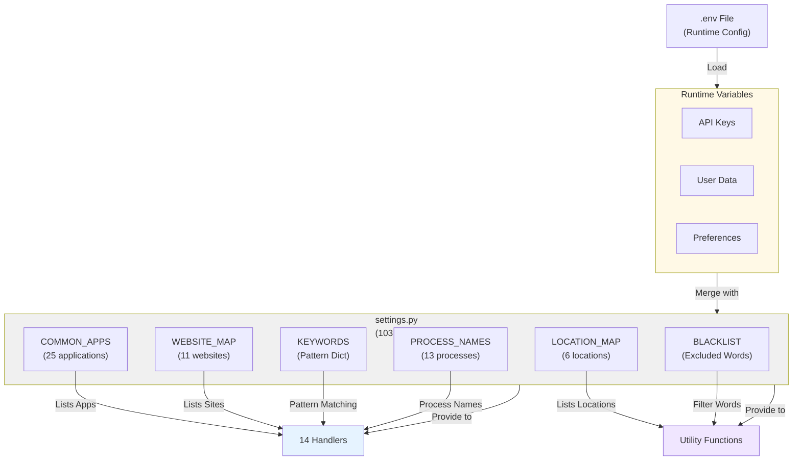

---

## 8️⃣ DEPLOYMENT ARCHITECTURE

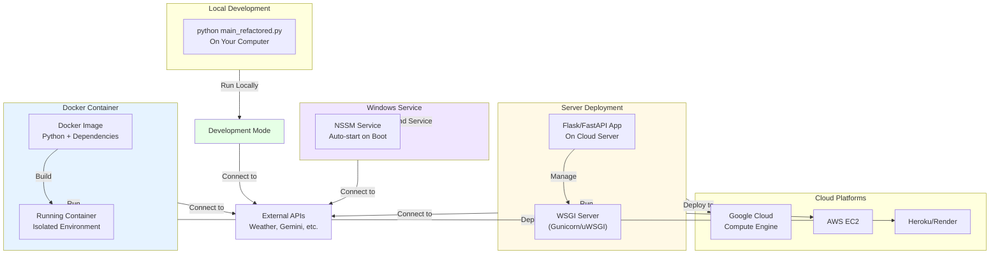

---

## 9️⃣ DATA FLOW - COMPLETE JOURNEY

```mermaid
graph LR
    U["🎤 User"]
    
    subgraph Input["1. INPUT"]
        VI["voice_io.py<br/>Listen & Record"]
        GCP["Google STT<br/>Convert Audio→Text"]
        TEXT["Extract Text"]
    end
    
    subgraph Processing["2. PROCESSING"]
        TP["text_processing.py<br/>Normalize & Clean"]
        KW["Extract Keywords"]
        ROUTER["Command Router<br/>Priority Check"]
    end
    
    subgraph Routing["3. ROUTING"]
        H1["Handler 1"]
        H2["Handler 2"]
        H3["Handler 3"]
        HN["Handler N"]
        FB["Gemini<br/>Fallback"]
    end
    
    subgraph Execution["4. EXECUTION"]
        LOGIC["Execute Handler<br/>Logic"]
        API["Call APIs<br/>if needed"]
        RESP["Generate<br/>Response"]
    end
    
    subgraph Storage["5. STORAGE"]
        LOGGER["logger.py<br/>Create Entry"]
        JSONL["assistant.jsonl<br/>Append Line"]
    end
    
    subgraph Output["6. OUTPUT"]
        TTS["Text-to-Speech<br/>voice_io.py"]
        SPEAK["Speak Response"]
    end
    
    U -->|Speak| VI
    VI -->|Audio Bytes| GCP
    GCP -->|Text| TEXT
    TEXT -->|Normalized| TP
    TP -->|Cleaned Text| KW
    KW -->|Keywords| ROUTER
    
    ROUTER -->|Route| H1
    ROUTER -->|Route| H2
    ROUTER -->|Route| H3
    ROUTER -->|Route| HN
    ROUTER -->|No Match| FB
    
    H1 & H2 & H3 & HN & FB -->|Execute| LOGIC
    LOGIC -->|Call| API
    API -->|Response| RESP
    
    RESP -->|Response| LOGGER
    LOGGER -->|Log Entry| JSONL
    
    RESP -->|Text| TTS
    TTS -->|Audio| SPEAK
    SPEAK -->|Output| U
    
    style U fill:#fff
    style Input fill:#e6f3ff
    style Processing fill:#f0e6ff
    style Routing fill:#fff9e6
    style Execution fill:#e6ffe6
    style Storage fill:#ffe6e6
    style Output fill:#f0f0f0
```

---

## 🔟 TECHNOLOGY STACK

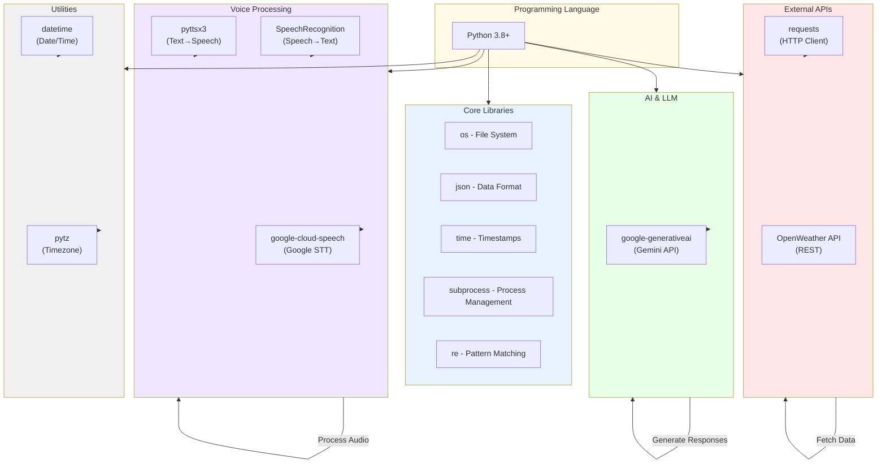

---

## 1️⃣1️⃣ ERROR HANDLING & FALLBACK FLOW

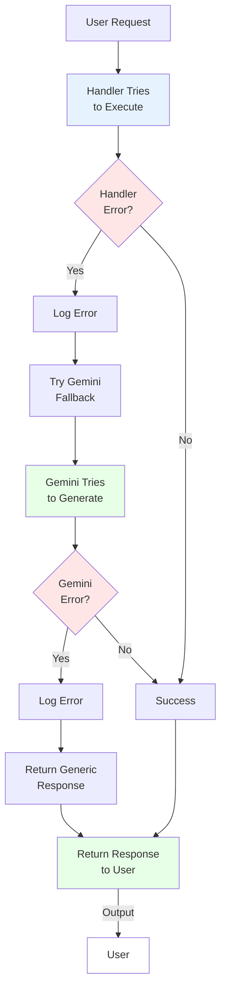

---

## 1️⃣2️⃣ FILE STRUCTURE TREE (VISUAL)

```mermaid
graph TD
    ROOT["📁 EchoMind AI<br/>(Project Root)"]
    
    ROOT --> MAIN1["📄 main.py<br/>(Legacy)"]
    ROOT --> MAIN2["📄 main_refactored.py<br/>(Current - 80 lines)"]
    ROOT --> GEMINI["📄 gemini_client.py<br/>(AI Client)"]
    ROOT --> REQ["📄 requirements.txt<br/>(Dependencies)"]
    ROOT --> ENV1["📄 .env<br/>(Credentials)"]
    ROOT --> ENV2["📄 .env.example<br/>(Template)"]
    ROOT --> GIT["📄 .gitignore"]
    
    ROOT --> CONFIG["📁 config/"]
    CONFIG --> C1["⚙️ settings.py<br/>(103 lines)"]
    CONFIG --> C2["📄 __init__.py"]
    
    ROOT --> UTILS["📁 utils/"]
    UTILS --> U1["🎤 voice_io.py<br/>(63 lines)"]
    UTILS --> U2["✂️ text_processing.py<br/>(34 lines)"]
    UTILS --> U3["⏰ time_utils.py<br/>(33 lines)"]
    UTILS --> U4["🌤️ weather.py<br/>(16 lines)"]
    UTILS --> U5["📝 logger.py<br/>(18 lines)"]
    UTILS --> U6["📄 __init__.py"]
    
    ROOT --> HANDLERS["📁 handlers/"]
    HANDLERS --> H1["greeting_handler.py"]
    HANDLERS --> H2["thank_you_handler.py"]
    HANDLERS --> H3["time_handler.py"]
    HANDLERS --> H4["date_handler.py"]
    HANDLERS --> H5["simple_weather_handler.py"]
    HANDLERS --> H6["weather_handler.py"]
    HANDLERS --> H7["web_handler.py"]
    HANDLERS --> H8["file_handler.py"]
    HANDLERS --> H9["app_handler.py"]
    HANDLERS --> H10["personal_handler.py"]
    HANDLERS --> H11["volume_handler.py"]
    HANDLERS --> H12["close_app_handler.py"]
    HANDLERS --> H13["exit_handler.py"]
    HANDLERS --> H14["__init__.py"]
    
    ROOT --> LOGS["📁 logs/"]
    LOGS --> LOG["📊 assistant.jsonl<br/>(Interaction Log)"]
    
    ROOT --> DOCS["📁 Documentation/"]
    DOCS --> D1["📖 README.md"]
    DOCS --> D2["📖 ARCHITECTURE_DETAILED.md"]
    DOCS --> D3["📖 QUICK_START_FINAL.md"]
    
    style ROOT fill:#fff9e6
    style CONFIG fill:#e6f3ff
    style UTILS fill:#f0e6ff
    style HANDLERS fill:#e6ffe6
    style LOGS fill:#ffe6e6
    style DOCS fill:#f0f0f0
```

---

## 1️⃣3️⃣ INTERACTION LOGGING SYSTEM

```mermaid
graph LR
    User["User<br/>Speaks/Types"]
    
    App["EchoMind AI<br/>Processes"]
    
    Handler["Handler<br/>Generates Response"]
    
    Logger["logger.py<br/>log_interaction()"]
    
    Entry["JSON Entry<br/>Created"]
    
    File["assistant.jsonl<br/>JSONL Format"]
    
    User -->|Input| App
    App -->|Process| Handler
    Handler -->|Response| Logger
    
    Logger -->|Create| Entry
    Entry -->|Structure:<br/>ts, user, response, source| File
    
    File -->|Append Mode<br/>One Line per Entry| Storage["📊 File System<br/>logs/ Directory"]
    
    style User fill:#fff
    style App fill:#e6f3ff
    style Handler fill:#e6ffe6
    style Logger fill:#f0e6ff
    style Entry fill:#fff9e6
    style File fill:#ffe6e6
    style Storage fill:#f0f0f0
```

---

## Summary

These 13 Mermaid diagrams provide complete architectural visualization of your EchoMind AI:

1. ✅ **System Overview** - High-level component interaction
2. ✅ **Request Flow** - Sequential request processing
3. ✅ **Handler Priority** - Decision tree for routing
4. ✅ **Module Architecture** - File/folder organization
5. ✅ **API Data Flow** - External service integration
6. ✅ **Handler Execution** - Step-by-step processing
7. ✅ **Configuration** - Settings hierarchy
8. ✅ **Deployment Options** - Different deployment methods
9. ✅ **Complete Data Journey** - Full request lifecycle
10. ✅ **Technology Stack** - Libraries and dependencies
11. ✅ **Error Handling** - Fallback and error management
12. ✅ **File Structure** - Project organization
13. ✅ **Logging System** - Data persistence

All diagrams are production-ready and can be used for documentation, presentations, or developer onboarding! 🎯
