<a id="top"></a>

# 🎙️ EchoMind AI - Voice Assistant

> Advanced Python-based voice assistant with natural language processing, intelligent command routing, and multiple integration features.

**Author:** Babin Bid  
**License:** MIT License

---

## 📋 Table of Contents

1. [Features](#-features)
2. [Command Features](#-command-features)
3. [Architecture](#️-architecture)
4. [Quick Start](#-quick-start)
5. [Configuration](#️-configuration)
6. [Usage Examples](#-usage-examples)
7. [Project Structure](#-project-structure)
8. [Commands Reference](#-commands-reference)
9. [Handler System](#-handler-system)
10. [Logging](#-logging)
11. [Troubleshooting](#-troubleshooting)
12. [Contributing](#-contributing)
13. [Additional Documentation](#-additional-documentation)
14. [Roadmap](#-roadmap)
15. [FAQ](#-faq)
16. [Support](#-support)
17. [License](#-license)
18. [Credits](#-credits)

---

## ✨ Features

### Core Capabilities

#### 🗣️ Voice I/O
- **Speech Recognition:** Real-time voice input processing
- **Text-to-Speech:** Natural voice feedback using system TTS
- **Streaming Support:** Support for streaming AI responses
- **Multi-language:** English support with extensible architecture

#### 🧠 AI Integration
- **Gemini API:** Advanced AI for unmatched query handling
- **Streaming Responses:** Real-time AI response streaming
- **Smart Fallback:** Automatic fallback to Gemini for unknown commands
- **Context Awareness:** Maintains conversation context

#### 📱 System Integration
- **Windows Search:** App discovery and launching via Windows Search
- **Volume Control:** Voice-controlled speaker volume adjustment
- **Battery Status:** Real-time battery monitoring and alerts
- **USB Detection:** Automatic USB device detection and reporting

---

## 🔧 Command Features

### 📂 File & Folder Management
| Command | Example | Action |
|---------|---------|--------|
| **Open System Folders** | "Open Desktop" | Opens Desktop folder |
| | "Open Downloads" | Opens Downloads folder |
| | "Open Documents" | Opens Documents folder |
| | "Open Pictures" | Opens Pictures folder |
| | "Open Music" | Opens Music folder |
| | "Open Videos" | Opens Videos folder |
| **Open Drives** | "Open drive C" | Opens C:\ drive |
| | "Open drive D" | Opens D:\ drive |
| | "Open drive E" | Opens any connected drive |
| **Close/Eject Drives** | "Close drive C" | Safely ejects C: |
| | "Eject drive D" | Alternative verb |
| | "Unmount drive E" | Another verb option |

### 🌐 Browser & Web
| Command | Example | Action |
|---------|---------|--------|
| **Web Search** | "Search for Python" | Searches in default browser |
| | "Google machine learning" | Google search results |
| **Open Websites** | "Open YouTube" | Opens YouTube.com |
| | "Open GitHub" | Opens GitHub.com |
| **WhatsApp Web** | "Open WhatsApp" | Opens WhatsApp Web |

### 🎵 Multimedia
| Command | Example | Action |
|---------|---------|--------|
| **YouTube Music** | "Play music by artist" | Plays on YouTube |
| | "Play song name" | Searches and plays |
| **Local Music** | "Play music" | Plays local songs |

### 💻 Application Control
| Command | Example | Action |
|---------|---------|--------|
| **Open Apps** | "Open Notepad" | Launches application |
| | "Open Chrome" | Launches browser |
| **Close Apps** | "Close Notepad" | Closes application |
| | "Close Discord" | Closes app instance |
| **Tab Navigation** | "Move to 3rd tab" | Navigates to tab 3 (Ctrl+3) |
| | "Next tab" | Moves to next tab (Ctrl+Tab) |
| | "Previous tab" | Previous tab (Ctrl+Shift+Tab) |
| | "Last tab" | Jump to last tab (Ctrl+9) |
| | "Close current tab" | Closes active tab (Ctrl+W) |

### ⚙️ System Control
| Command | Example | Action |
|---------|---------|--------|
| **Volume** | "Increase volume" | Raises speaker volume |
| | "Decrease volume" | Lowers speaker volume |
| | "Mute" | Mutes audio |
| **Brightness** | "Make brightness 50" | Sets brightness to 50% |
| | "Brightness seventy" | Sets brightness to 70% |
| | "Increase brightness" | Increases to 75% |
| | "Decrease brightness" | Decreases to 25% |
| **Emoji** | "Open emoji" | Opens emoji picker |
| | "Show emoji" | Opens emoji picker |
| **Battery** | "Battery status" | Reports battery level |
| | "Check battery" | Battery percentage |
| **USB Devices** | "USB status" | Lists connected USB devices |
| | "Check USB" | Reports USB connections |

### 📝 Utilities
| Command | Example | Action |
|---------|---------|--------|
| **Time** | "What time is it" | Reads current time |
| **Date** | "What's the date" | Reads current date |
| **Weather** | "Weather in London" | Weather information |
| **File Operations** | "Write file" | Creates/writes files |
| **Greeting** | "Hello" | Responds with greeting |
| **Exit** | "Exit" | Closes application |

---

## 🏗️ Architecture

### System Overview


### Command Routing Flow

```mermaid
flowchart TD
    A["👂 User Speaks<br/>Command"] --> B["🎯 listen()<br/>Speech to Text"]
    B --> C["📝 Text Command<br/>Received"]
    C --> D{"Route Command<br/>to Handlers"}
    
    D -->|Priority 1-3| E["Text Input<br/>Greeting<br/>Thank You"]
    D -->|Priority 4-5| F["Emoji Mode<br/>Time/Date"]
    D -->|Priority 6-7| G["Resume<br/>USB Detection"]
    D -->|Priority 8-10| H["Browser Search<br/>Website<br/>Weather"]
    D -->|Priority 11-12| I["WhatsApp<br/>Battery<br/>Music"]
    D -->|Priority 13-15| J["File Ops<br/>System Folders<br/>Brightness"]
    D -->|Priority 16-17| K["Volume Control<br/>Tab Navigation<br/>App Control"]
    D -->|Priority 18| L["Exit Command"]
    D -->|No Match| M["🤖 Gemini AI<br/>Fallback"]
    
    E --> N["Generate<br/>Response"]
    F --> N
    G --> N
    H --> N
    I --> N
    J --> N
    K --> N
    L --> N
    M --> N
    
    N --> O["✅ Format Response<br/>with ? if question"]
    O --> P["🔊 speak()<br/>Text to Speech"]
    P --> Q["📊 Log to<br/>assistant.jsonl"]
    Q --> R["👤 User Hears<br/>Response"]
    
    style E fill:#e1f5ff
    style F fill:#e8f5e9
    style G fill:#f3e5f5
    style H fill:#fff3e0
    style I fill:#fce4ec
    style J fill:#e0f2f1
    style K fill:#f1f8e9
    style L fill:#ffebee
    style M fill:#ffe0b2
```



### Handler Priority & Routing

```mermaid
graph TD
    CMD["📥 Command Input"]
    
    CMD --> P1["🔵 Priority 1-3<br/>Text Input | Greeting<br/>Thank You"]
    P1 --> P2["🟢 Priority 4-5<br/>Emoji Mode | Time/Date"]
    P2 --> P3["🟡 Priority 6-7<br/>Resume Opening<br/>USB Detection"]
    P3 --> P4["🟠 Priority 8-10<br/>Browser Search<br/>Website | Weather"]
    P4 --> P5["🔴 Priority 11-12<br/>WhatsApp | Battery<br/>Music Operations"]
    P5 --> P6["🟣 Priority 13-15<br/>File Operations<br/>System Folders<br/>Brightness"]
    P6 --> P7["🟦 Priority 16-17<br/>Volume Control<br/>Tab Navigation<br/>App Control"]
    P7 --> P8["⚫ Priority 18<br/>Exit Handler"]
    
    P1 -.->|Match Found| DONE["✅ Response<br/>Generated"]
    P2 -.->|Match Found| DONE
    P3 -.->|Match Found| DONE
    P4 -.->|Match Found| DONE
    P5 -.->|Match Found| DONE
    P6 -.->|Match Found| DONE
    P7 -.->|Match Found| DONE
    P8 -.->|Match Found| DONE
    P8 -->|No Match| FALLBACK["🤖 Gemini AI<br/>Fallback"]
    FALLBACK --> DONE
    
    DONE --> OUTPUT["🔊 speak()"]
    
    style P1 fill:#e1f5ff
    style P2 fill:#e8f5e9
    style P3 fill:#f3e5f5
    style P4 fill:#fff3e0
    style P5 fill:#fce4ec
    style P6 fill:#e0f2f1
    style P7 fill:#f1f8e9
    style P8 fill:#ffebee
    style FALLBACK fill:#ffe0b2
    style DONE fill:#c8e6c9
```



### Data Flow Architecture

```mermaid
graph TB
    subgraph "Input Layer"
        A["🎤 Audio Stream"]
        B["🎙️ Speech Recognition<br/>Google API"]
        C["📝 Text Command"]
    end
    
    subgraph "Processing Layer"
        D["🔄 Text Normalization"]
        E["🔍 Symbol Conversion"]
        F["✨ Question Mark Detection"]
        G["🧭 Command Routing<br/>route_command()"]
    end
    
    subgraph "Handler Execution"
        H1["Handler 1<br/>Text/Greeting"]
        H2["Handler 2-18<br/>Domain Specific"]
        H3["Fallback<br/>Gemini AI"]
    end
    
    subgraph "Output Layer"
        I["📄 Format Response"]
        J["🎙️ Text to Speech<br/>pyttsx3"]
        K["🔊 Audio Output"]
    end
    
    subgraph "Persistence"
        L["📊 JSON Logging<br/>assistant.jsonl"]
    end
    
    A --> B
    B --> C
    C --> D
    D --> E
    E --> F
    F --> G
    
    G -->|Priority 1-18| H1
    G -->|Try Handlers| H2
    G -->|No Match| H3
    
    H1 -->|Response| I
    H2 -->|Response| I
    H3 -->|Response| I
    
    I --> J
    J --> K
    
    C -.->|Log| L
    G -.->|Log| L
    I -.->|Log| L
    K -.->|Log| L
    
    style A fill:#e3f2fd
    style B fill:#bbdefb
    style C fill:#90caf9
    style D fill:#64b5f6
    style E fill:#42a5f5
    style F fill:#2196f3
    style G fill:#1976d2
    style H1 fill:#c8e6c9
    style H2 fill:#81c784
    style H3 fill:#ffcc80
    style I fill:#ffe0b2
    style J fill:#ffb74d
    style K fill:#ffa726
    style L fill:#a1887f
```



---

## 🚀 Quick Start

### Prerequisites
- Python 3.13+
- Windows 10/11 (primary support)
- Microphone for voice input
- Speaker for voice output
- Internet connection (for Gemini API & weather)

### Installation

1. **Clone Repository**
```bash
git clone <repository-url>
cd "Voice Assistant/EchoMind AI"
```

2. **Install Dependencies**
```bash
pip install -r requirements.txt
```

3. **Configure Environment**
```bash
# Copy example to .env
cp .env.example .env

# Edit .env with your settings:
GEMINI_API_KEY=your_key_here
GEMINI_API_STREAM=true
```

4. **Run Assistant**
```bash
python main_refactored.py
```

---

## ⚙️ Configuration

### Environment Variables (.env)

```ini
# Gemini AI Configuration
GEMINI_API_KEY=your_gemini_api_key_here
GEMINI_API_STREAM=true          # Enable streaming responses (true/false)

# System Settings
SYSTEM_VOLUME_STEP=5            # Volume change amount per command
BATTERY_CHECK_INTERVAL=30       # Battery check interval in seconds

# Logging
LOG_LEVEL=INFO                  # DEBUG, INFO, WARNING, ERROR
LOG_FILE=logs/assistant.jsonl   # Log file path
```

### Key Configuration Files

| File | Purpose |
|------|---------|
| `.env` | Runtime secrets and API keys (⚠️ Never commit) |
| `.env.example` | Template for .env configuration |
| `config/settings.py` | Application settings and constants |
| `requirements.txt` | Python dependencies |

---

## 📖 Usage Examples

### Basic Usage

```bash
# Start the assistant
python main_refactored.py

# Voice commands
Say: "What time is it?"      → Responds with current time
Say: "Open Desktop"          → Opens Desktop folder
Say: "Close drive E"         → Safely ejects E: drive
Say: "Play music"            → Starts playing music
Say: "Exit"                  → Closes application
```

### Advanced Features

#### Tab Navigation
```
Say: "Move to 5th tab"
Say: "Next tab"
Say: "Previous tab"
Say: "Close current tab"
```

#### Drive Operations
```
Say: "Open drive C"          # Opens C:\ in Explorer
Say: "Close drive D"         # Safely ejects D:
Say: "Eject drive E"         # Alternative syntax
```

#### App Management
```
Say: "Open Notepad"          # Launches Notepad
Say: "Close Chrome"          # Closes Chrome browser
Say: "Search for Python"     # Opens web search
```

---

## 📁 Project Structure

```
EchoMind AI/
├── 📄 .env                        # Environment variables (secrets)
├── 📄 .env.example                # Environment template
├── 📄 .gitignore                  # Git ignore patterns
├── 📄 README.md                   # This file
├── 📄 gemini_client.py            # Gemini AI integration
├── 📄 main_refactored.py          # Main entry point
├── 📄 requirements.txt            # Python dependencies
├── 🗂️ config/                     # Configuration module
│   ├── __init__.py
│   ├── __pycache__/
│   └── settings.py                # Settings & constants
├── 🗂️ handlers/                   # Command handlers (23)
│   ├── __init__.py
│   ├── __pycache__/
│   ├── app_handler.py             # App opening/launching
│   ├── battery_handler.py         # Battery status monitoring
│   ├── brightness_handler.py      # Brightness control
│   ├── close_app_handler.py       # App closing/tab control
│   ├── date_handler.py            # Date queries
│   ├── emoji_handler.py           # Emoji picker
│   ├── exit_handler.py            # Exit command
│   ├── file_handler.py            # File operations
│   ├── file_writing_handler.py    # File writing operations
│   ├── greeting_handler.py        # Greeting responses
│   ├── music_handler.py           # Music playback
│   ├── personal_handler.py        # Personal questions
│   ├── resume_handler.py          # Resume file opening
│   ├── simple_weather_handler.py  # Simple weather queries
│   ├── system_folder_handler.py   # Folder & drive operations
│   ├── tab_navigation_handler.py  # Tab navigation (Ctrl+N)
│   ├── text_input_handler.py      # Text input handling
│   ├── thank_you_handler.py       # Thank you responses
│   ├── time_handler.py            # Time queries
│   ├── usb_detection_handler.py   # USB device detection
│   ├── volume_handler.py          # Volume control
│   ├── weather_handler.py         # Weather queries
│   └── web_handler.py             # Web search & browser
├── 🗂️ logs/                       # Log storage
│   └── assistant.jsonl            # JSON logs of all operations
├── 🗂️ utils/                      # Utility modules
│   ├── __init__.py
│   ├── __pycache__/
│   ├── logger.py                  # Logging utilities
│   ├── text_processing.py         # Text processing & normalization
│   ├── time_utils.py              # Time utility functions
│   ├── voice_io.py                # Voice input/output operations
│   └── weather.py                 # Weather API utilities
└── 🗂️ __pycache__/                # Python bytecode cache
```

---

## 🎮 Commands Reference

### Time & Date
| Say | Response |
|-----|----------|
| "What time is it?" | Current time |
| "What's the time?" | Current time |
| "What date is it?" | Current date |
| "Today's date" | Current date |

### System
| Say | Response |
|-----|----------|
| "Battery status" | Battery percentage & status |
| "USB devices" | List of connected USB |
| "Increase volume" | Raises volume |
| "Decrease volume" | Lowers volume |
| "Make brightness 50" | Sets brightness to 50% |
| "Brightness seventy" | Sets brightness to 70% |
| "Open emoji" | Opens emoji picker |

### Brightness Control
| Say | Response |
|-----|----------|
| "Make brightness 40%" | Sets brightness to 40% |
| "Brightness 50" | Sets brightness to 50% |
| "Set brightness to seventy" | Sets brightness to 70% |
| "Increase brightness" | Increases to 75% |
| "Decrease brightness" | Decreases to 25% |

### Emoji Mode
| Say | Response |
|-----|----------|
| "Open emoji" | Opens emoji picker |
| "Show emoji" | Opens emoji picker |
| "Emoji picker" | Opens emoji picker |

### Files & Folders
| Say | Response |
|-----|----------|
| "Open Desktop" | Opens Desktop folder |
| "Open Downloads" | Opens Downloads folder |
| "Open drive C" | Opens C:\ drive |
| "Close drive E" | Safely ejects E: |
| "Write file" | Creates/writes file |
| "Open resume" | Opens resume document |

### Browser & Web
| Say | Response |
|-----|----------|
| "Search Python" | Web search in browser |
| "Open YouTube" | Opens YouTube.com |
| "Open GitHub" | Opens GitHub.com |
| "Open WhatsApp" | Opens WhatsApp Web |

### Applications
| Say | Response |
|-----|----------|
| "Open Notepad" | Launches Notepad |
| "Open Chrome" | Launches Chrome browser |
| "Close Discord" | Closes Discord app |
| "Move to 3rd tab" | Navigates to tab 3 |

### General
| Say | Response |
|-----|----------|
| "Hello" | Greeting response |
| "Thank you" | Thank you response |
| "Open emoji" | Opens emoji picker |
| "Exit" / "Quit" | Closes application |

---

## 🔍 Handler System

### How Handlers Work

Each handler is a specialized module that:
1. **Detects** specific command patterns (regex matching)
2. **Processes** the command logic
3. **Returns** response or False (if not matched)

### Handler Priority

Commands are checked in this order:
1. Text input mode
2. Greeting & thank you
3. Emoji mode
4. Time & date
5. Resume file opening
6. USB & search
7. Website & weather
8. Battery & media
9. File operations
10. Music & file writing
11. File & system folder operations
12. App launching
13. Personal questions
14. Brightness control
15. Volume control & tab navigation
16. App closing
17. Exit command
18. **Gemini AI Fallback** (for unmatched queries)

### Adding Custom Handlers

1. Create `handlers/custom_handler.py`:
```python
def handle_custom_command(command):
    if "trigger_word" in command.lower():
        # Process command
        from utils.voice_io import speak
        speak("Custom response")
        return True
    return False
```

2. Add to `main_refactored.py`:
```python
from handlers.custom_handler import handle_custom_command
# ... in handlers list
("Custom feature", handle_custom_command),
```

---

## 📊 Logging

All voice commands and responses are logged to `logs/assistant.jsonl`:

```json
{
  "timestamp": "2025-11-06T10:30:00Z",
  "command": "Open Desktop",
  "response": "Opening Desktop folder",
  "source": "local",
  "status": "success"
}
```

---

## 🐛 Troubleshooting

### Voice Not Recognized
- Check microphone is connected and working
- Speak clearly and in English
- Check system volume is adequate

### Commands Not Working
- Verify .env configuration is correct
- Check logs in `logs/assistant.jsonl`
- Ensure dependencies are installed (`pip install -r requirements.txt`)

### Gemini API Errors
- Verify `GEMINI_API_KEY` in .env is correct
- Check internet connection
- Check API quota/limits

### App Won't Start
- Ensure Python 3.13+ is installed
- Run `pip install -r requirements.txt` 
- Check .env file exists and is configured

---

## 🤝 Contributing

Contributions are welcome! Please:

1. Create a feature branch (`git checkout -b feature/new-feature`)
2. Commit changes (`git commit -am 'Add feature'`)
3. Push to branch (`git push origin feature/new-feature`)
4. Open a Pull Request

---

## 📚 Additional Documentation

For detailed feature documentation, see:

- **Brightness & Emoji Features:** `QUICK_START_BRIGHTNESS_EMOJI.md`

---

## 🎯 Roadmap

### Planned Features
- [ ] Multi-language support (Spanish, French, German)
- [ ] Custom voice profiles
- [ ] Smart home integration
- [ ] Email integration
- [ ] Calendar management
- [ ] Task management

### Performance Improvements
- [ ] Command caching
- [ ] Faster speech recognition
- [ ] Offline mode support
- [ ] Response time optimization

---

## ❓ FAQ

**Q: Does it require internet?**
A: Yes, for Gemini AI and weather features. Local commands work offline.

**Q: Can I add custom commands?**
A: Yes! Create a handler in `handlers/` and add to routing in `main_refactored.py`.

**Q: Is it free to use?**
A: Yes, but requires Gemini API key (free tier available).

**Q: What operating systems are supported?**
A: Primary: Windows 10/11. Secondary: macOS (partial), Linux (partial).

**Q: How is my data handled?**
A: All data is logged locally in `logs/assistant.jsonl`. No data sent elsewhere except Gemini API queries.

---

## 📧 Support

For issues, questions, or suggestions:
- Open an issue on GitHub
- Check existing documentation
- Review logs in `logs/assistant.jsonl`

---

## 📝 License

This project is licensed under the **MIT License** - see the [LICENSE](LICENSE) file for details.

### License Summary

This is **Babin Bid's personal project**. You are free to:
- ✅ Use for personal, educational, or commercial purposes
- ✅ Modify and distribute the code
- ✅ Create derivative works
- ✅ Use commercially

You must:
- 📋 Include the original license and copyright notice
- 📋 Document any significant modifications
- 📋 Provide a copy of the LICENSE file with distributions

### Third-Party Libraries

This project uses several open-source libraries:
- **pyttsx3** - Text-to-speech (Apache License 2.0)
- **SpeechRecognition** - Speech recognition (BSD 3-Clause License)
- **google-generativeai** - Google Gemini AI integration (Apache License 2.0)
- **pyautogui** - GUI automation (BSD 3-Clause License)
- **requests** - HTTP library (Apache License 2.0)
- **python-dotenv** - Environment variable management (BSD 3-Clause License)

See `requirements.txt` and individual package documentation for more details.

---

## 🎉 Credits

Built with Python, integrated with:
- Google Gemini AI
- Windows API
- pyautogui for automation
- pyttsx3 for text-to-speech

**Project Author:** Babin Bid  
**GitHub:** https://github.com/KGFCH2/OIBSIP/tree/main/Voice%20Assistant/EchoMind%20AI

---

**Last Updated:** November 6, 2025
**Version:** 1.0
**Status:** Production Ready ✅

---

<div align="center">

### 📖 [Back to Top](#top) ⬆️

</div>
